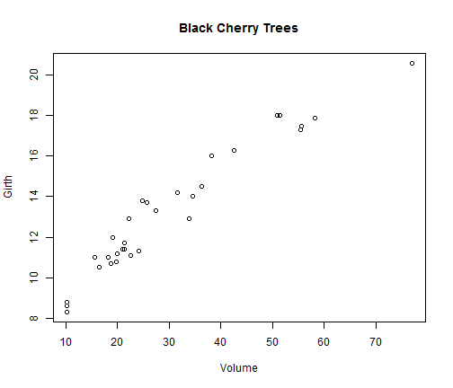
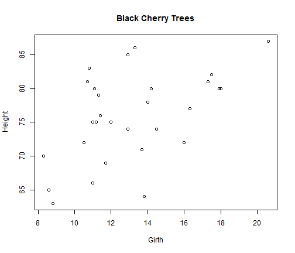

## Application Concept

* R contains a dataset of some of the parameters of black cherry trees
* These parameters include:
  + Trunk Girth
  + Tree Height
  + Tree Volume
* The Shiny application allows to plot each of the above variables in comparison to any other

--- .class #id 

## Usage Instructions

* select the wanted variable for the X axis
* select the wanted variable for the Y axis
* Voila! Observe the graph as requested

--- .class #id 

## Example 1

An example plot of Girth as function of Volume.


```r
plot(trees$Volume, trees$Girth, xlab = "Volume", ylab = "Girth", main = "Black Cherry Trees")
```



--- .class #id 

## Example 2

An example plot of Height as function of Girth.


```r
plot(trees$Girth, trees$Height, xlab = "Girth", ylab = "Height", main = "Black Cherry Trees")
```



